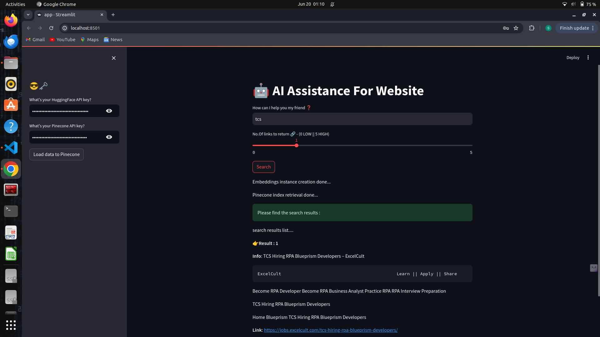

# C2C-ClickToCareer-Chatbot



The C2C-ClickToCareer Chatbot is an AI-powered assistant designed to help users access and process career-related information from websites. It leverages the advanced capabilities of HuggingFace for creating high-quality embeddings and Pinecone for efficient vector database management. The application is built using Streamlit, providing an interactive user interface for an enhanced user experience.

Features:
- Efficiently fetches data from website sitemaps using asynchronous loading.
- Splits large documents into manageable chunks for better processing and searchability.
- Implements HuggingFace's SentenceTransformer for high-quality text embeddings.
- Leverages Pinecone to store and retrieve vector representations of documents, ensuring fast and accurate search results.
- Streamlit integration allows for easy interaction and real-time response display.

## 1) Installation

Clone the repository:
```
git clone https://github.com/saleena-18/C2C-ClickToCareer-Chatbot.git
cd your-repo-name
```
## 2) Install dependencies:
```
pip install -r requirements.txt
```
## 3) Run the Streamlit application:
```
streamlit run app.py
```

## 4) Enter API Keys:

Input your HuggingFace API key.
Input your Pinecone API key.

## 5) Load Data

Click the "Load data to Pinecone" button to fetch and store data from the website.

## 6) Interact with the Chatbot:

Enter your query in the input box to receive relevant information from the vector database.
